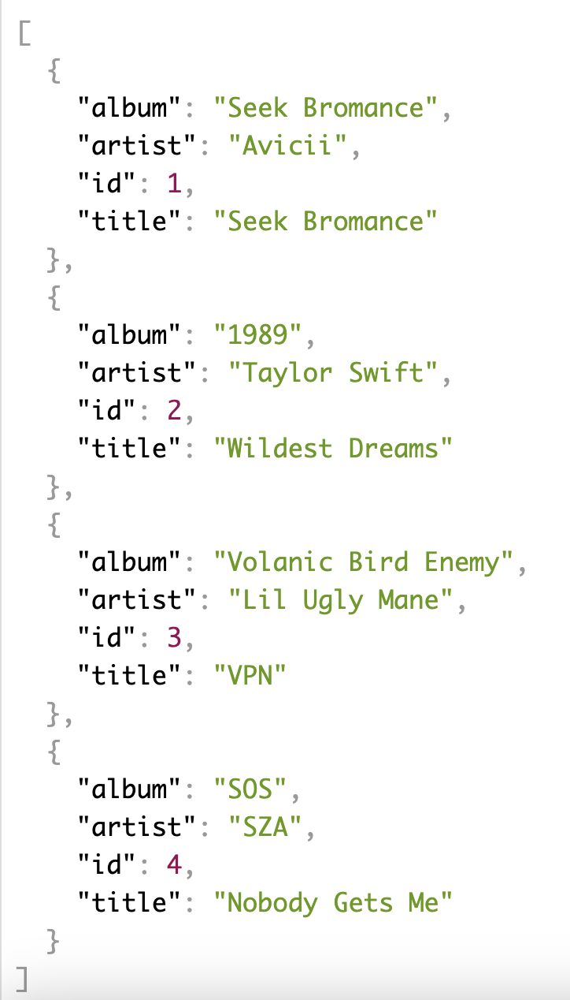
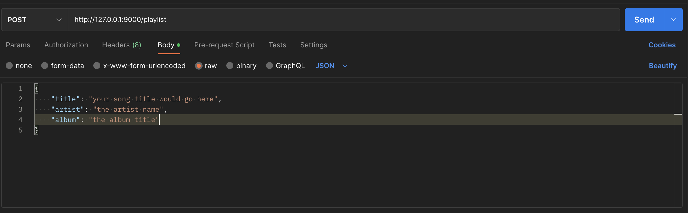

# Playlist API 🎶

## Introduction

Using [Flask](https://flask.palletsprojects.com/en/2.3.x/), [Peewee](https://docs.peewee-orm.com/en/latest/), [Psycopg2](https://www.psycopg.org/docs/) and [Python](https://docs.python.org/3/) I crerated a Playlist API that displays the song title, song artist and the album that the song is on.

I'm also using [PostgreSQL](https://www.postgresql.org/) as the database which is storing all the songs created!

This is a RESTful API implementing full CRUD functionality.

## How to Use:

1. Fork and clone this repository.
2. Install the dependencies using the below command in your terminal while inside this directory:
```
pipenv install
```
3. Make sure you are working in the shell enviroment by running the below command:
```
pipenv shell
```
4. Once inside the shell environment run the below command to start up the local host that the API is deployed on:
```
python3 app.py
```
5. After running the above command in the terminal, you can connect to the local server by typing the below endpoint into your browser.
```
http://127.0.0.1:9000/playlist
```
6. That above endpoint should display something like the below screenshot if you have a JSON Viewer Extension on your browser. (I personally like to use [JSON Viewer](https://chrome.google.com/webstore/detail/json-viewer/gbmdgpbipfallnflgajpaliibnhdgobh).)


## CRUD Functionality
CRUD stands for: Create, Read, Update and Delete. This API allows for all of the above! 

### Create
---
By implementing the use of an API Platform (ie. [Postman](https://www.postman.com/)) you can create your own song to add to the playlist! 

Type in the below endpoint into Postman:
```
http://127.0.0.1:9000/playlist
```
That should display something like the below:


In order to create a song you have to do the following:
- Make sure you have "POST" selected as your HTTP verb
- Click on the "Body" option, followed by the "raw" option and then choose "JSON" as the format.
- Create a new song following the Song Schema. so be sure to include a song title, artist of the song, and the album that the song is on.

### Read
---
Access the same endpoint as above in your browser or Postman by using a GET request.

You'll be able to view (or read) all of the items that are in the API.

### Update
---
To update a song, make sure you've selected the PUT HTTP verb and that you type in the above endpoint in Postman followed by the id of the song that you would like to update. See below for an example:
```
http://127.0.0.1:9000/playlist/1
```

The "/1" that is added to the endpoint lets the API know that you want to update the first song in the database. 


### Delete
---

## Resources
- [Peewee](https://docs.peewee-orm.com/en/latest/)
- [Psycopg2](https://www.psycopg.org/docs/)
- [Autopep8](https://pypi.org/project/autopep8/)
- [Python](https://docs.python.org/3/)
- [Pipenv](https://pipenv.pypa.io/en/latest/)
- [Flask](https://flask.palletsprojects.com/en/2.3.x/)
- [Postman](https://www.postman.com/)